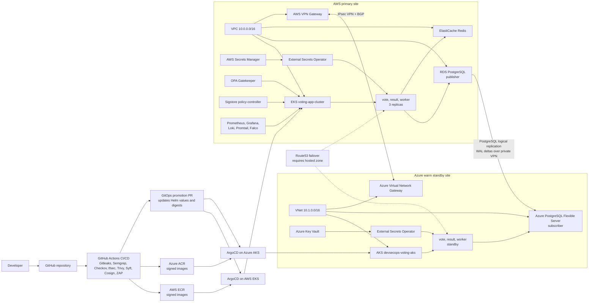

# Cloud Architecture Diagram

Use this diagram in slides or report to explain the deployed cloud architecture. It is intentionally infrastructure-focused, while the pipeline diagram should stay CI/CD-focused.

## Notes For Drawing This Manually

1. Draw GitHub and GitHub Actions on the left.
2. Draw two large boxes: `AWS primary` and `Azure warm standby`.
3. Inside AWS, include EKS, ECR, RDS, ElastiCache, Secrets Manager, VPN Gateway, and security/observability controllers.
4. Inside Azure, include AKS, ACR, Azure PostgreSQL, Key Vault, and Virtual Network Gateway.
5. Connect AWS VPN Gateway to Azure Virtual Network Gateway with `IPsec VPN + BGP`.
6. Connect AWS RDS to Azure PostgreSQL with `native logical replication`.
7. Put Route53 DNS failover as dashed/optional unless a hosted zone is actually configured.
