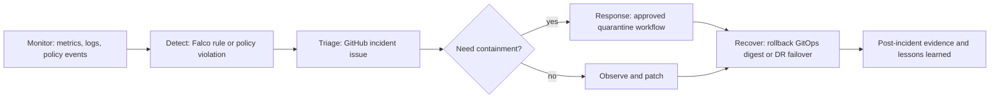

# DevSecOps Phase Model

Tài liệu này dùng để thuyết trình theo đúng logic thầy yêu cầu: nói rõ từng phase làm gì trước, sau đó mới nói công cụ nào được dùng để triển khai phase đó. Công cụ không phải là trung tâm của sơ đồ; công cụ chỉ là cách hiện thực hóa một mục tiêu kiểm soát cụ thể.

## Pipeline Nhìn Theo Chức Năng

```mermaid
flowchart LR
  A["Plan: scope, threat model, policy"] --> B["Code: feature branch"]
  B --> C["Feature gate: fast feedback before dev"]
  C -->|pass| D["Integration branch: dev"]
  C -->|fail| I1["Issue to developer with failed check and remediation"]
  D --> E["Integration gate: combined code/config validation"]
  E -->|pass| F["Release PR: dev to main"]
  E -->|fail| I2["Fix integration breakage on dev"]
  F --> G["Release gate: final static checks before artifact build"]
  G -->|pass| H["Build artifact: container images and SBOM"]
  G -->|fail| I3["Block release PR"]
  H --> J["Supply-chain gate: sign digest, verify identity and crypto policy"]
  J --> K["Image security test: scan immutable digest"]
  K --> L["Deploy staging: ArgoCD syncs staging GitOps branch"]
  L --> M["Dynamic test: smoke test and OWASP ZAP DAST"]
  M -->|pass| N["Promotion PR: update production image digests"]
  M -->|fail| I4["DAST issue and no production promotion"]
  N --> O["Deploy production: ArgoCD syncs main after review"]
  O --> P["Operate: monitor, detect, respond, recover"]
  P --> B
```



## Mapping Phase Sang Target Và Tool

| Phase | Target thật sự cần kiểm tra | Tool hiện thực | Failure trả về đâu |
| --- | --- | --- | --- |
| Feature gate | Secret, bug pattern, dependency risk, sanity build của thay đổi nhỏ | Gitleaks, Semgrep, Trivy FS, `python -m py_compile`, `npm audit`, `dotnet build` | PR annotation + GitHub Issue cho developer |
| Integration gate | Code/config sau khi nhiều feature đã merge vào `dev` | Gitleaks, Semgrep, Checkov, tfsec, Trivy FS, Helm render, Conftest | Chặn nhánh `dev` khỏi trở thành release candidate |
| Release gate | Final source + IaC + deploy config trước khi build artifact | Cùng bộ full gate, chạy trên PR `dev -> main` | Chặn merge vào `main` |
| Build artifact | Thành phẩm chạy được, không còn là source code rời rạc | Docker build, Syft SBOM | Fail workflow, không push promotion |
| Supply-chain gate | Image digest có nguồn gốc đúng workflow và chữ ký dùng crypto an toàn | Cosign keyless, GitHub OIDC, Fulcio cert, `scripts/verify-cosign-signature-policy.sh` | Fail workflow trước Trivy/promote |
| Image security test | CVE trong image đã build | Trivy image scan theo digest | Fail workflow trước staging/promote |
| Staging deploy | Desired state staging độc lập production | Branch `staging`, ArgoCD app `voting-staging`, namespace `voting-staging` | ArgoCD OutOfSync/Degraded, không DAST |
| Dynamic test | Ứng dụng thật đã chạy và reachable | Smoke test `/healthz`, OWASP ZAP baseline | Không mở promotion PR |
| Production promotion | Thay đổi production desired state có review boundary | GitOps PR cập nhật `values-prod.yaml`, `values-azure.yaml` | Không merge production |
| Production deploy | Production sync từ Git, không deploy tay | ArgoCD app `voting-production`, Azure `voting-azure-production` | ArgoCD history/events thể hiện lỗi |
| Operate | Functional + security telemetry | Prometheus/Grafana, Loki/Promtail, Falco, Gatekeeper/Kyverno/Sigstore events | GitHub incident issue, quarantine workflow, rollback/DR runbook |

## Vì Sao Không Vẽ Tool Thành Chuỗi Cứng

Một số kiểm tra có thể chạy song song vì chúng kiểm tra các target độc lập:

- Secret scan không cần chờ IaC scan.
- SAST không cần chờ Helm render.
- Checkov và tfsec đều đọc Terraform/config tĩnh.

Một số bước bắt buộc tuần tự vì có phụ thuộc thật:

- DAST phải sau deploy staging và smoke test vì ZAP cần endpoint sống.
- Trivy image scan phải sau build/push digest vì scan target là image digest.
- Cosign keyless signing phải ký digest immutable. Với OCI registry thực tế, digest rõ ràng sau khi push hoặc sau khi image được định danh bằng registry digest.
- Production deploy phải sau promotion PR vì production desired state nằm trong Git.

## Signature Crypto Policy

CI không chỉ kiểm tra “có chữ ký hay không”. Sau khi `cosign verify` xác nhận issuer/identity, script `scripts/verify-cosign-signature-policy.sh` đọc X.509 certificate metadata và reject các thuật toán yếu:

- Reject: `md5`, `sha1`.
- Allow: `sha256`, `sha384`, `sha512`, `ed25519`.
- EC/EdDSA key phải tối thiểu 256-bit.
- RSA key phải tối thiểu 3072-bit.

Điểm cần nói khi vấn đáp:

```text
Cosign kiểm tra chữ ký, certificate identity, issuer và transparency log.
Script bổ sung kiểm tra crypto policy của certificate/signature algorithm.
Trivy không kiểm tra chữ ký; Trivy chỉ scan vulnerability/misconfig/secrets.
```

## Deploy Audit

Khi thầy hỏi audit deploy, không trả lời chung chung là “có log”. Cần tách ra:

- Ai yêu cầu thay đổi: GitHub PR author/reviewer.
- Ai build/sign: GitHub Actions OIDC subject trong Cosign certificate.
- Artifact nào: image digest, SBOM artifact, workflow run ID.
- Ai deploy: ArgoCD controller sync từ Git revision nào.
- Deploy ở đâu: namespace `voting-staging` hoặc `voting-production`, cluster AWS/Azure.
- Policy nào cho phép/chặn: Gatekeeper/Kyverno/Sigstore events.
- Runtime ra sao: Kubernetes events, Loki logs, Prometheus metrics, Falco alerts.

## Runtime Detect, Respond, Recover



Functional metrics:

- Pod readiness/restarts.
- HTTP success rate.
- p95 latency.
- CPU/memory pressure.

Security metrics/events:

- Falco runtime alerts.
- Admission denials from Gatekeeper/Kyverno/Sigstore.
- Unsigned image rejection.
- Suspicious shell/process inside workload pod.
