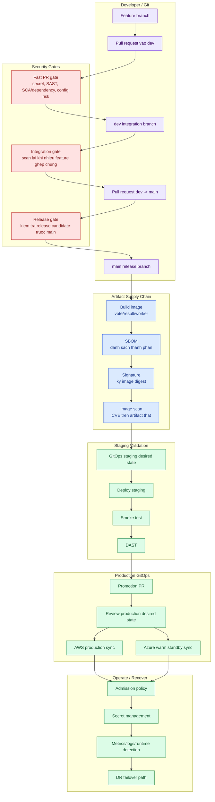

# So Do Pipeline DevSecOps

File nay dung de mo khi can giai thich pipeline bang hinh. Cach doc: di tu trai sang phai, moi khoi la mot diem kiem soat rui ro. Tool cu the nam trong ngoac de nguoi xem biet implementation, nhung y nghia chinh la muc tieu kiem soat.

## 1. Pipeline Tong The

```mermaid
flowchart LR
  Dev["Developer<br/>viet feature/fix"] --> Branch["Feature branch<br/>tach thay doi rieng"]
  Branch --> PRDev["Pull request vao dev<br/>review + fast feedback"]

  PRDev --> Secret["Secret scan<br/>chan token/password/key hardcode"]
  PRDev --> SAST["Static code scan<br/>bat bug va mau lo hong"]
  PRDev --> SCA["Source dependency scan / SCA<br/>bat CVE trong lockfile va third-party libraries"]
  PRDev --> ConfigScan["Config/IaC scan<br/>bat cau hinh nguy hiem"]

  Secret --> FeatureGate{"Feature gate pass?"}
  SAST --> FeatureGate
  SCA --> FeatureGate
  ConfigScan --> FeatureGate
  FeatureGate -- "Fail" --> FixFeature["Developer sua loi<br/>push commit moi"]
  FixFeature --> Branch
  FeatureGate -- "Pass + review" --> DevBranch["dev<br/>integration branch"]

  DevBranch --> Integration["Integration gate<br/>kiem tra nhieu feature khi ghep chung"]
  Integration --> ReleasePR["PR dev -> main<br/>release boundary"]
  ReleasePR --> ReleaseGate{"Release gate pass?"}
  ReleaseGate -- "Fail" --> FixRelease["Sua release candidate"]
  FixRelease --> DevBranch
  ReleaseGate -- "Pass + review" --> Main["main<br/>release source"]

  Main --> Build["Build container images<br/>vote/result/worker"]
  Build --> SBOM["Generate SBOM<br/>biet image gom thanh phan nao"]
  Build --> Sign["Sign image digest<br/>chung minh image dung nguon"]
  Build --> ImageScan["Image vulnerability scan<br/>chan CVE nghiem trong"]

  SBOM --> ArtifactGate{"Artifact gate pass?"}
  Sign --> ArtifactGate
  ImageScan --> ArtifactGate
  ArtifactGate -- "Fail" --> StopRelease["Dung release<br/>khong deploy"]
  ArtifactGate -- "Pass" --> StagingGit["Cap nhat desired state staging<br/>GitOps branch staging"]

  StagingGit --> Staging["ArgoCD deploy staging<br/>app chay that tren Kubernetes"]
  Staging --> Smoke["Smoke test /healthz<br/>kiem tra app song"]
  Staging --> DAST["DAST baseline<br/>quet web app dang chay"]

  Smoke --> StagingGate{"Staging gate pass?"}
  DAST --> StagingGate
  StagingGate -- "Fail" --> NoPromote["Khong promote<br/>sua loi va build lai"]
  StagingGate -- "Pass" --> PromotePR["Promotion PR<br/>cap nhat values prod/Azure"]

  PromotePR --> ProdReview{"Review production change?"}
  ProdReview -- "Reject" --> NoPromote
  ProdReview -- "Approve + merge" --> ProdGit["main<br/>desired state production"]

  ProdGit --> AWSProd["AWS production<br/>ArgoCD sync"]
  ProdGit --> AzureStandby["Azure warm standby<br/>ArgoCD sync"]

  AWSProd --> Runtime["Runtime controls<br/>policy, secret, monitor, log, alert"]
  AzureStandby --> Runtime
  Runtime --> DR["Recovery / DR<br/>failover path khi primary loi"]

  classDef human fill:#f8fafc,stroke:#334155,stroke-width:1px,color:#0f172a;
  classDef gate fill:#fef3c7,stroke:#b45309,stroke-width:2px,color:#78350f;
  classDef security fill:#fee2e2,stroke:#b91c1c,stroke-width:1px,color:#7f1d1d;
  classDef artifact fill:#dbeafe,stroke:#1d4ed8,stroke-width:1px,color:#1e3a8a;
  classDef deploy fill:#dcfce7,stroke:#15803d,stroke-width:1px,color:#14532d;
  classDef fail fill:#f3f4f6,stroke:#6b7280,stroke-dasharray: 4 3,color:#111827;

  class Dev,Branch human;
  class FeatureGate,ReleaseGate,ArtifactGate,StagingGate,ProdReview gate;
  class Secret,SAST,SCA,ConfigScan,Integration,ReleasePR security;
  class Build,SBOM,Sign,ImageScan artifact;
  class StagingGit,Staging,Smoke,DAST,PromotePR,ProdGit,AWSProd,AzureStandby,Runtime,DR deploy;
  class FixFeature,FixRelease,StopRelease,NoPromote fail;
```



## 2. Pipeline Theo Lane

So do nay dung khi muon giai thich ai lam gi va ranh gioi nam o dau.



## 3. Loi Thuyet Minh Ngan

```text
Pipeline nay khong phai chi la build va deploy. No la chuoi kiem soat rui ro. Developer tao PR thi he thong quet loi som nhu secret, SAST, SCA/dependency va cau hinh nguy hiem. SCA o tang source giup bat CVE trong dependency manifest/lockfile som de developer sua ngay. Khi code vao dev, pipeline kiem tra lai vi nhieu feature ghep chung co the sinh loi moi, sau do build artifact that, tao SBOM, ky image va scan CVE tren image da build. Artifact da pass moi len staging. Staging phai smoke test va DAST pass thi moi mo promotion PR vao main. PR nay chay release gate, gom source da test va production values pin dung image digest da test. Production khong deploy truc tiep tu CI, ma ArgoCD dong bo tu desired state trong Git. Sau deploy van co runtime policy, secret management, monitoring va DR.
```

## 4. Diem Can Nhan Manh Khi Giai Thich

- `Pull request` la diem bat loi som va review thay doi.
- Neu PR fail gate, developer sua tren feature branch va push commit moi; PR hien tai tu cap nhat va gate chay lai.
- `SCA/dependency scan` nam o PR gate de bat CVE trong third-party libraries som; `image scan` nam o artifact gate de quet image that sau build.
- `dev` la noi gom feature de kiem tra tong hop, khong phai production.
- `main` la ranh gioi release, khong phai noi push code tuy tien.
- `Build artifact` tao image bat bien, co the truy vet bang digest.
- `SBOM + signing + image scan` bao ve chuoi cung ung phan mem.
- `Staging + smoke + DAST` kiem tra app dang chay that.
- `Promotion PR` la ranh gioi production.
- `GitOps` giup production co audit, rollback va desired state ro rang.
- `Runtime controls` bao ve sau khi deploy, vi pipeline khong phai lop bao ve duy nhat.
