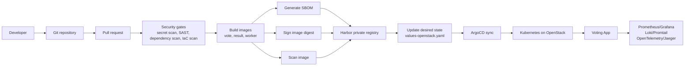

# DevSecOps Pipeline Diagram

```mermaid
flowchart LR
  Dev["Developer"] --> Repo["Git repository"]
  Repo --> PR["Pull request"]
  PR --> Gates["Security gates<br/>secret scan, SAST, dependency scan, IaC scan"]
  Gates --> Build["Build images<br/>vote, result, worker"]
  Build --> SBOM["Generate SBOM"]
  Build --> Sign["Sign image digest"]
  Build --> Scan["Scan image"]
  SBOM --> Registry["Harbor private registry"]
  Sign --> Registry
  Scan --> Registry
  Registry --> GitOps["Update desired state<br/>values-openstack.yaml"]
  GitOps --> Argo["ArgoCD sync"]
  Argo --> K8s["Kubernetes on OpenStack"]
  K8s --> App["Voting App"]
  App --> Obs["Prometheus/Grafana<br/>Loki/Promtail<br/>OpenTelemetry/Jaeger"]
```

The deployment boundary is GitOps. CI builds, scans, signs, and publishes artifacts, then updates desired state in Git. ArgoCD performs the cluster sync.
