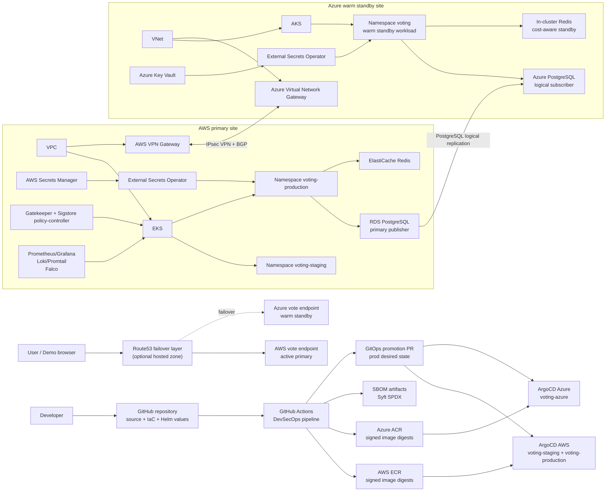
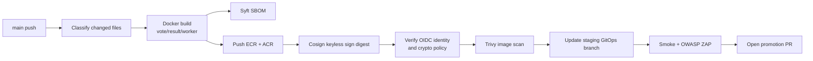
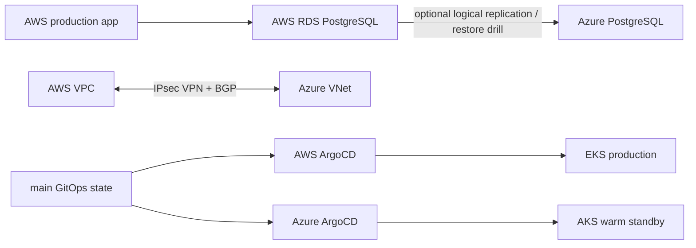

# Kien Truc Theo Huong Thay Yeu Cau

Tai lieu nay trinh bay kien truc theo logic: muc tieu va phase truoc, framework/tool sau. Khi thuyet trinh, khong noi "em dung tool A, B, C" ngay tu dau. Hay noi he thong can kiem soat rui ro gi, o phase nao, va tool nao hien thuc hoa control do.

## 1. Kien Truc Tong The

He thong la mot DevSecOps platform cho ung dung voting gom `vote`, `result`, `worker`, Redis va PostgreSQL. AWS la primary site, Azure la warm standby site.



### Cach noi ngan gon voi thay

```text
Kien truc cua em khong chi la CI/CD. No la vong DevSecOps day du:
source control -> security gate -> signed artifact -> GitOps deploy -> runtime policy -> observability -> incident response -> DR.
AWS chay primary, Azure la warm standby. Production khong deploy truc tiep tu CI, ma di qua GitOps PR va ArgoCD sync tu Git.
```

## 2. Kien Truc Phase Theo DevSecOps Lifecycle

| Phase | Muc tieu kiem soat | Framework / tool hien thuc | Ket qua dung |
| --- | --- | --- | --- |
| Plan | Xac dinh scope, rui ro, boundary dev/main/prod | Threat model, branch protection, GitHub PR rules | Co approval boundary ro rang |
| Code | Developer thay doi ung dung/IaC/Helm | Git branch, PR, pre-commit | Loi co ban bi bat som |
| Feature gate | Fast feedback truoc khi vao `dev` | Gitleaks, Semgrep, Trivy FS, SonarCloud | PR feature khong dua secret/bug ro rang vao dev |
| Integration gate | Kiem tra tong the sau khi merge vao `dev` | Gitleaks, Semgrep, Checkov, tfsec, Trivy FS, Helm lint/template, Conftest | `dev` thanh release candidate sach |
| Release gate | Chan release sai truoc `main` | Full security gate tren PR `dev -> main` | Chi source/config da qua gate moi vao main |
| Build | Tao artifact bat bien | Docker, GitHub Actions matrix | Co image cho vote/result/worker |
| Supply chain | Chung minh image dung nguon va khong bi thay the | Syft SBOM, Cosign keyless, Fulcio/Rekor, GitHub OIDC | Image digest co SBOM va chu ky |
| Image security | Scan artifact sau khi build | Trivy image scan by digest | CVE HIGH/CRITICAL bi chan |
| Staging deploy | Chay ban build that tren moi truong truoc production | GitOps branch `staging`, ArgoCD app `voting-staging` | Staging `Synced Healthy` |
| Dynamic test | Kiem tra app dang song nhu attacker/user that | Smoke `/healthz`, OWASP ZAP baseline | DAST pass truoc promotion |
| Production promotion | Doi desired state production co review | GitOps promotion PR, Helm values digest | Production khong bi auto-push truc tiep |
| Production deploy | Cluster tu sync theo Git | ArgoCD `voting-production`, Azure `voting-azure` | AWS/Azure `Synced Healthy` |
| Operate | Giam sat, phat hien, phan ung | Prometheus, Grafana, Loki, Promtail, Falco, incident workflow | Co evidence runtime va response path |
| Recover / DR | Khoi phuc khi AWS fail | Azure AKS warm standby, PostgreSQL logical replication, Route53 failover script | Co RTO/RPO demo path |

## 3. Kien Truc Trien Khai Cu The

### 3.1 Source, Branch va Approval Boundary

```mermaid
flowchart LR
  Feature["feature/*"] --> PRDev["PR to dev\nFeature PR light gate"]
  PRDev --> Dev["dev\nintegration branch"]
  Dev --> DevGate["Dev integration security gates"]
  DevGate --> PRMain["PR dev -> main\nRelease PR full gate"]
  PRMain --> Main["main\nrelease branch"]
  Main --> Build["Build/sign/scan/deploy staging"]
  Build --> PromotePR["GitOps promotion PR\nvalues-prod + values-azure"]
  PromotePR --> MainProd["main updated\nproduction desired state"]
```



Branch protection hien tai:

- `dev`: required check `Feature PR light security gates`, 1 approving review.
- `main`: required check `Release PR full security gates`, 1 approving review.
- Admin bypass chi dung cho demo/test khi da co ket qua check pass, sau do protection duoc khoi phuc.

### 3.2 CI/CD va Supply Chain

Pipeline chinh nam o `.github/workflows/ci-pipeline.yml`.



Framework/tool cu the:

- GitHub Actions: pipeline orchestration.
- GitHub OIDC: cloud auth khong dung static cloud key.
- Docker: build container artifact.
- Syft: SBOM.
- Cosign keyless: ky image digest bang identity cua workflow.
- Fulcio/Rekor: certificate va transparency log cua Sigstore.
- Trivy: image vulnerability scan.
- Script `scripts/verify-cosign-signature-policy.sh`: verify identity, issuer, va crypto policy cua certificate.

Dieu can nhan manh:

```text
Trivy khong thay the Cosign. Cosign tra loi "artifact co dung nguon va co chu ky hop le khong".
Trivy tra loi "artifact do co CVE nghiem trong khong".
Hai control nay khac nhau va deu can co.
```

### 3.3 GitOps Deployment

| Environment | Git source | ArgoCD app | Namespace | Values file |
| --- | --- | --- | --- | --- |
| AWS staging | branch `staging` | `voting-staging` | `voting-staging` | `values-staging.yaml` |
| AWS production | branch `main` | `voting-production` | `voting-production` | `values-prod.yaml` |
| Azure warm standby | branch `main` | `voting-azure` | `voting` | `values-azure.yaml` |

Deployment framework:

- Kubernetes: runtime orchestration.
- Helm: package/render Kubernetes manifests.
- ArgoCD: GitOps reconciliation.
- Terraform: provision AWS/Azure infra and platform controllers.

Why GitOps:

```text
CI khong kubectl apply vao production. CI chi tao artifact va thay doi desired state trong Git.
ArgoCD la deployment controller, nen audit deploy gom Git commit, PR, ArgoCD revision va Kubernetes event.
```

### 3.4 Runtime Security va Policy

| Control | AWS primary | Azure standby |
| --- | --- | --- |
| Kubernetes hardening | PSS labels, restricted securityContext, read-only root FS | Same Helm baseline |
| Admission policy | Gatekeeper, Sigstore policy-controller | Gatekeeper/Kyverno baseline, ACR verify disabled by cost/private-registry constraint |
| Signed image enforcement | Sigstore ClusterImagePolicy for ECR images | Images are signed and deployed from ACR, strict admission can be enabled later with registry credential support |
| Secrets | AWS Secrets Manager + External Secrets Operator | Azure Key Vault + External Secrets Operator |
| Detection | Falco/Falcosidekick | Standby baseline |
| Monitoring/logging | Prometheus, Grafana, Loki, Promtail | Cost-aware standby verification |

### 3.5 Multi-Cloud va DR



DR story:

- AWS la active primary.
- Azure AKS sync cung desired state production nhu standby.
- Data path co san runbook PostgreSQL logical replication tu AWS RDS sang Azure PostgreSQL. Trong live demo cost-capped, Azure DB co the de placeholder `restore-required` va trinh bay nhu buoc DR restore/replication drill.
- Route53 failover script da co, nhung can hosted zone/domain that de kich hoat public DNS failover.
- Azure student subscription co cost/quota constraint: result service de `ClusterIP`, Redis dung in-cluster Redis, ACR dung Basic SKU.

## 4. Evidence Hien Tai De Dua Vao Slide

Trang thai da verify ngay sau khi hoan thanh:

```text
AWS ArgoCD:
- voting-staging: Synced Healthy
- voting-production: Synced Healthy

Azure ArgoCD:
- voting-azure: Synced Healthy

Health:
- AWS staging /healthz: HTTP 200
- AWS production /healthz: HTTP 200
- Azure warm standby /healthz: HTTP 200

CI:
- Main release pipeline: success
- GitOps promotion pipeline: success
```

Run IDs:

- Full main release: `26556068376`
- GitOps promotion: `26556732195`

## 5. Cach Tra Loi Khi Thay Hoi "Kien Truc Nay Khac Gi CI/CD Thuong?"

```text
CI/CD thuong chi build va deploy. Kien truc nay them cac control DevSecOps:
1. PR gate de chan loi truoc khi merge.
2. Supply-chain gate de ky va verify image digest.
3. GitOps de production deploy tu Git, khong tu lenh thu cong.
4. Admission policy de cluster tu choi workload sai policy.
5. Runtime detection va observability de phat hien sau deploy.
6. DR sang Azure de khong phu thuoc mot cloud.
```

## 6. Dieu Can Noi That Khi Bi Hoi Gioi Han

- Azure ACR Basic khong co mot so tinh nang Premium nhu private endpoint, geo-replication, Defender integration.
- Route53 failover can hosted zone/domain that; script da san sang nhung hien tai khong co hosted zone trong account.
- Azure signed-image admission chua enforce nhu AWS vi private ACR verification can cau hinh registry credential bo sung; AWS EKS la noi enforce Sigstore policy-controller chinh.
- Canary rollout chua dung Argo Rollouts; hien tai dung rolling update, readiness/liveness probe va rollback bang Git revert.
